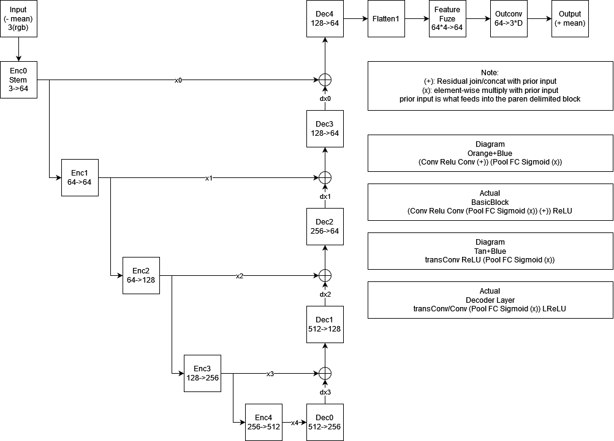
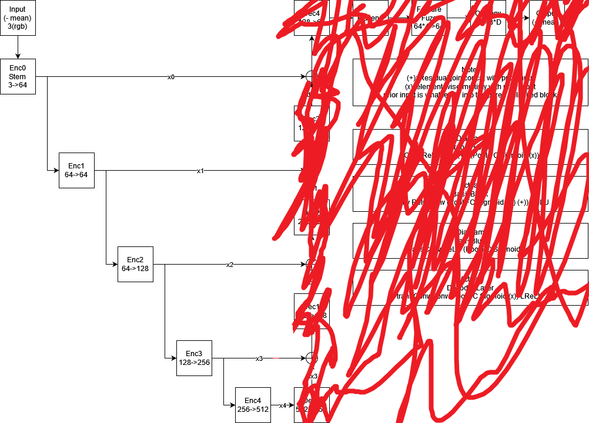

# cuFLAVR

## CIS 565 Fall 2021
### Team 03: Aditya Hota, Richard Chen, Kaan Erdogmus


## Introduction

It is said that a picture is worth a thousand words. 

Just think, at 24 fps, just one minute of sound-free video footage would be worth 24,000 words.

<!-- Which is why this README shall not contain any pictures and instead be a giant wall of text. -->


<!-- That cinematic frame rate is already lower than accepatable for playing video games, yet it would take fewer than 25 minutes to tell all of Lord of the Rings. 

Anything to do with videos require lots of computational muscle.  -->

<!-- There are already many people who use high refresh rate monitors, from 90Hz to 300+Hz. Imagine if, instead of using gigabytes and terabytes of  -->
In a world of high refresh rate monitors and 4K60 videos, imagine a world where we instead stored lower frame rate videos and dynamically adjust them to the desired smoothness. 
* Lower bandwith would be required for streaming video. 
* More videos could be stored on the same hard drive. 
* Animators would no longer need to draw in-between frames. 

Such magic technology is no longer purely in the realm of science fiction.

<b>Frame interpolation</b> generates new frames that go in between existing video frames.  

Here, we attempt to implement one method of frame interpolation, a machine learning model called FLAVR.

## Background

We are attempting to implement the FLAVR architecture at a low level using CUDA kernels and cuDNN. Our work is based off the model presented by Tarun Kalluri, Deepak Pathak, Manmohan Chandraker, and Du Tran in their paper _FLAVR: Flow-Agnostic Video Representations for Fast Frame Interpolation_.

The GPU, or Graphics Processing Unit, was initially created to offload the task of displaying images from the CPU. This task often involved performing the same computation on a bunch of independent pixels. As they became more powerful, GPUs carved out a niche for accelerating massively parallel computation tasks. 

Neural Networks, are widely used in Machine Learning. Between the many interconnected neurons and the weights/biases that associated with each one, neural networks consist of a giant pile of linear algebra, with some nonlinear math also thrown in for good measure (to be a universal classifier). 

Thus, GPUs are used to do machine learning tasks like training neural networks and running them to perform inference. Just take the example of matrix multiplication, each element of the product is an independent dot product of factor matrices. 

CUDA (Compute Unified Device Architecture) is a parallel computing API made by NVidia for general purpose gpu computing.

Since one of the main jobs of a computer is to compute, there are many APIs that aim to speed up computation and/or provide a unified interface so other programs may use them. Oftentimes, they make use of the modern bells and whistles that CPUs have, for example, SIMD and Vector extensions to be as fast as possible. Famous ones include BLAS - Basic Linear Algebra Subprograms. 

NVidia has libraries that accelerate such tasks by running them on the GPU. cuBLAS is the GPU version of BLAS, and their cuDNN library implements many functions used in Deep Neural Networks.

## FLAVR


Figure 1. Sampling procedure of FLAVR network, obtained from FLAVR paper
CIS565 Final Project

---



Figure 2. A deeper look into the architecture of the FLAVR network

---

One of the key features of FLAVR for frame interpolation is in its very name: Flow Agnostic. 

According to the paper, many try to solve the problem using bidirectional optical flow between adjacent video frames. However, occlusions and nonlinear motion are weaknesses to that approach. 

By contrast, this method uses space-time convolutions and learned weights and biases in order to predict the intermediate motion. And it is intermediate motion since the model takes in 4 frames and interpolates the frames in between 2 and 3. For example, at 2x interpolation, if given frames 0 through 3, a frame 1.5 would be added. 

By using spatiotemporal convolutions, they remove the need to explicitly account for optical flow, and this simpler model results in faster inference speeds. 

## Our Model



Here we see that the we successfully implemented the encoder half of the network.
For the decoder and postprocessing portions, we interfaced the intermediate tensors
back into the pytorch model to run it to completion. 

---


Image | Layers from Our Model
------|----------------
 | x0, x1
 | x0, x1, x2


## Performance

Measurements of the encoder layers in the PyTorch model. Measured with `time.perf_counter()`
Layer    | PyTorch Time (ms) | cuFLAVR Time (ms)
---------|-------------------|------------
Stem     | 1.973048 |
Layer 1  | 1.095656 |
Layer 2  | 0.765495 |
Layer 3  | 0.722510 |
Layer 4  | 0.712768 | 

## Conclusions

## Other
* Floating point math is not commutative; often our values had the least significant figure slightly off making it impossible to diff or cmp against the known tensor, to say nothing of -ffast-math or possible hardware specific fixed function trigonometric functions
* 5d tensors, necessary to use 3d spacetime convolutions, seem to be second-class citizens when it comes to cuDNN compared to 4d tensors
* 


<!-- This Specific
    3d Convolutions
    network architecture
General
    cuDNN
    CUDA
Woes
    cuDNN API (convolutionBiasActivationForward sigmoid, no lrelu, tensors are gnarly)
```

0  1  2  3  4  5  6  7  <-frame number
1  0  1  0  1  0  1  0  <-keep
         1              <-interpolate
``` -->
